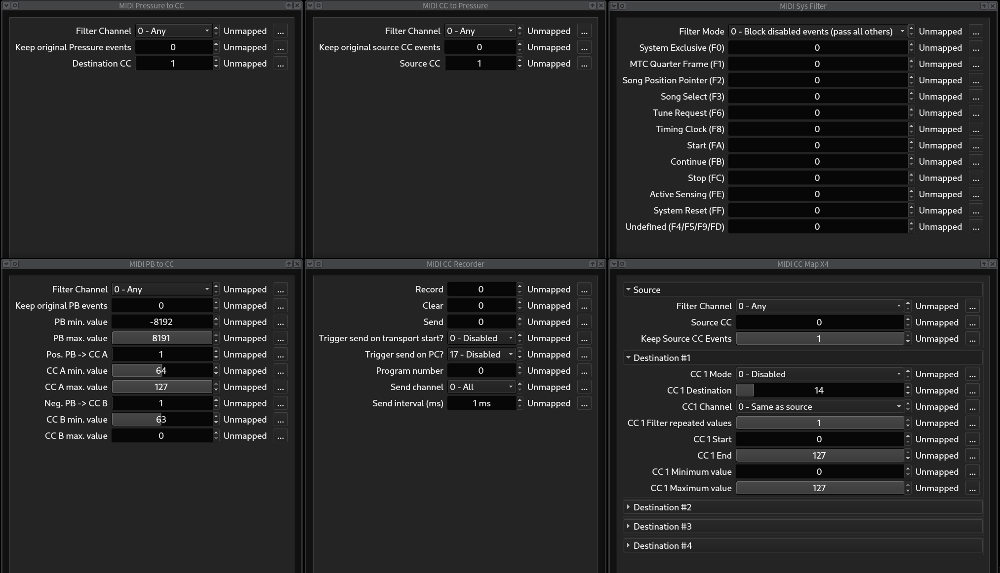

# MIDI-o-matic

A collection of MIDI filter, generator and processor plugins

## Plugins

[MIDI CC Map X4](./plugins.md#midi-cc-map-x4) - Map a single input CC to up to
four output CCs.

[MIDI CC Recorder](./plugins.md#midi-cc-recorder) - Store received Control
Change messages and replay them when triggered.

[MIDI CC to Pressure](./plugins.md#midi-cc-to-pressure) - Convert Control
Change messages into (monophonic) Channel Pressure (Aftertouch).

[MIDI PB to CC](./plugins.md#midi-pb-to-cc) - Convert Pitch Bend into Control
Change messages.

[MIDI Pressure to CC](./plugins.md#midi-pressure-to-cc) - Convert (monophonic)
Channel Pressure (Aftertouch) into Control Change messages.

[MIDI Sys Filter](./plugins.md#midi-sys-filter) - Filter out MIDI System
Messages.

## Plugin Formats

The plugins are available in the following formats:

* [LV2]
* [VST2]

## Compiling

Make sure, you have installed the required build tools and libraries (see
section "Prerequisites" below) and then clone this repository (including
sub-modules) and simply run `make` in the project's root directory:

    $ git clone --recursive https://github.com/SpotlightKid/midiomatic.git
    $ cd midiomatic
    $ make

## Installation

To install the plugins system-wide, run (root priviledges may be required):

    make install

The usual `PREFIX` and `DESTDIR` makefile variables are honoured to change
the prefix directory (default: `/usr/local`) and the installation destination
(for distribution packaging).

You can also set the installation directory for each plugin format with a
dedicated makefile variable.

* LV2: `LV2_DIR` (`<prefix>/lib/lv2`)
* VST2: `VST_DIR` (`<prefix>/lib/vst`)

Example:

    make DESTDIR=/tmp/build-root PREFIX=/usr VST_DIR=/usr/lib/lxvst install

Use make's `-n` option to see where the plugins would be installed without
actually installing them.

To install the plugins under your user's home directory, run:

    make install-user

No special makefile variables are used in this case.

## Prerequisites

* Git

* The GCC C++ compiler and the usual associated software build tools
  (`make`, etc.).

    Users of Debian / Ubuntu Linux should install the `build-essential`
    meta package to get these, Arch Linux users the `base-devel` package
    group.

* [pkgconf]

Optional (only needed for checking plugins after building them):

* [lv2lint]
* [KXStudio LV2 Extensions]

## License

This software is distributed under the MIT License.

See the file [LICENSE](./LICENSE) for more information.

## Authors

This software is written by *Christopher Arndt*.

Contributions by:

* *Jorik Jonker* (MIDI Pressure To CC plugin)

## Acknowledgements

Build using the DISTRHO Plugin Framework ([DPF]) and set up with the
[cookiecutter-dpf-effect] project template.

[cookiecutter-dpf-effect]: https://github.com/SpotlightKid/cookiecutter-dpf-effect
[dpf]: https://github.com/DISTRHO/DPF
[kxstudio lv2 extensions]: https://github.com/KXStudio/LV2-Extensions
[lv2]: http://lv2plug.in/
[lv2lint]: https://open-music-kontrollers.ch/lv2/lv2lint/
[pkgconf]: https://github.com/pkgconf/pkgconf
[vst2]: https://en.wikipedia.org/wiki/Virtual_Studio_Technology
