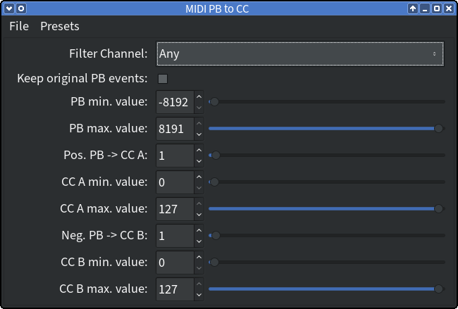

# MIDI-o-matic

A collection of MIDI filter, generator and processor plugins

## Plugins

### MIDI PBToCC

Convert Pitch Bend into Control Change messages

* Can act on all MIDI channels or a specific one.
* Supports different destination Control Change number for positive *(CC A)*
  and negative *(CC B)* Pitch Bend range.
* Affected input Pitch Bend value range can be set, allowing, for example, to
  convert only positive Pitch Bend values. If *PB min. value* is higher than
  *PB max. value*, then only Pitch Bend values *outside* of the range are
  converted.
* Allows to set the output value range for the Control Change messages.
  Positive Pitch Bend values within the input range set with *PB min. value*
  and *PB max. value* are mapped to the range set with *CC A min. value* and
  *CC A max. value*, negative Pitch Bend values within the input range are
  mapped the range set with *CC B min. value* and *CC B max. value*.
* Any unconverted messages are kept in the plugin's output.
* Original Pitch Bend messages in the input range can be optionally kept as
  well.

### MIDI SysFilter

A filter for MIDI System Messages

## Plugin Formats

The plugins are available in the following formats:

* [LV2]
* [VST2]

## Compiling

Make sure, you have installed the required build tools and libraries (see
section "Prerequisites" below) and then clone this repository (including
sub-modules) and simply run `make` in the project's root directory:

    $ git clone --recursive https://github.com/SpotlightKid/midiomatic.git
    $ cd midiomatic
    $ make

## Installation

To install the plugins system-wide, run (root priviledges may be required):

    make install

The usual `PREFIX` and `DESTDIR` makefile variables are honoured to change
the prefix directory (default: `/usr/local`) and the installation destination
(for distribution packaging).

You can also set the installation directory for each plugin format with a
dedicated makefile variable.

* LV2: `LV2_DIR` (`<prefix>/lib/lv2`)
* VST2: `VST_DIR` (`<prefix>/lib/vst`)

Example:

    make DESTDIR=/tmp/build-root PREFIX=/usr VST_DIR=/usr/lib/lxvst install

Use make's `-n` option to see where the plugins would be installed without
actually installing them.

To install the plugins under your user's home directory, run:

    make install-user

No special makefile variables are used in this case.

## Prerequisites

* Git

* The GCC C++ compiler and the usual associated software build tools
  (`make`, etc.).

    Users of Debian / Ubuntu Linux should install the `build-essential`
    meta package to get these, Arch Linux users the `base-devel` package
    group.

* [pkgconf]

## License

This software is distributed under the MIT License.

See the file [LICENSE](./LICENSE) for more information.

## Author

This software is written by *Christopher Arndt*.

## Acknowledgements

Build using the DISTRHO Plugin Framework ([DPF]) and set up with the
[cookiecutter-dpf-effect] project template.

[cookiecutter-dpf-effect]: https://github.com/SpotlightKid/cookiecutter-dpf-effect
[DPF]: https://github.com/DISTRHO/DPF
[LV2]: http://lv2plug.in/
[pkgconf]: https://github.com/pkgconf/pkgconf
[VST2]: https://en.wikipedia.org/wiki/Virtual_Studio_Technology
