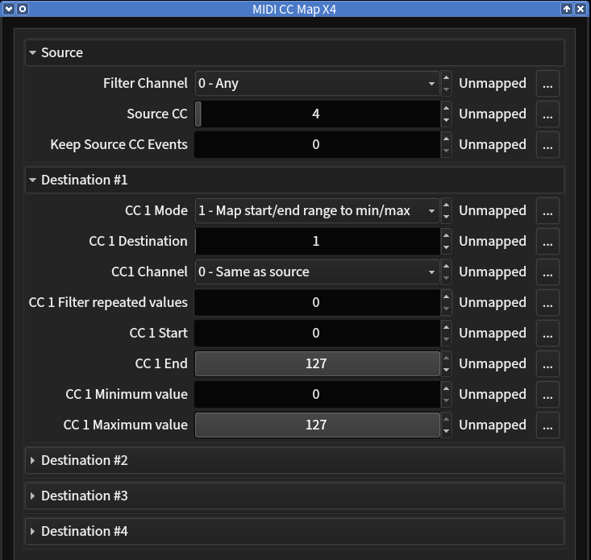
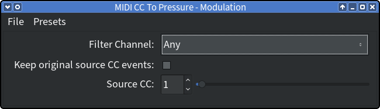
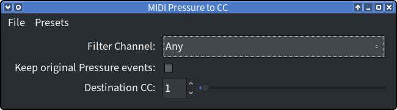
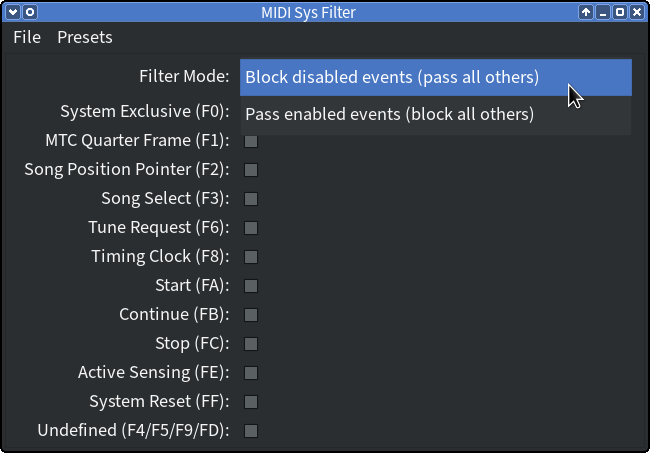

# Plugins

## MIDI CC Map X4

Map a single input CC to up to four output CCs.

* Can act on a selected CC received on all MIDI channels or a specific one.
* Converts the matching source Control Change message into up-to-four
  destination CCs.
* Each of the four destination CCs can be enabled separately and the following
  settings can be set for each (where X = 1..4):
    * `CC X Mode` - Enable destination CC X and set the control value mapping
      mode.
    * `CC X Destination` - the controller number
    * `CC X Channel` - the MIDI channel
    * `CC X Filter repeated values` - when enabled, if the control value
      (after conversion) of the destination Control Change message is the same
      as the one sent before (for this channel and controller number), it is
      supressed.
    * `CC X Start` and `CC X End` - the value range of the source
      Control Change message, which gets converted into this destination CC.

        If `Start > End`, only messages, whose controller value lies *outside*
        of the range `End` .. `Start` , are converted.
    * `CC X Minimum value` and `CC X maximum value` - the value range of
      the destination Control Change message to which the range of the source
      values is mapped.

        If `Minimum > Maximum`, the destination value range is inverted.
* Any unmatched Control Change messages or other events are kept in the
  plugin's output.
* The original source Control Change messages can be optionally kept in the
  plugin's output too (useful, for example, to cascade several instances of
  this plugin).

## MIDI CC Recorder

Store received Control Change messages and replay them when triggered.

**note:** *This plugin is still considered in beta stage. I recommend not using
it in an important project. The LV2 version should work as described, but there
may be issues with the VST2 version due to poor support for trigger inputs.*

* While "Record" is enabled, the plugin stores the last seen value of each
  Control Change message on each MIDI channel sent to its input.
* When the "Send" trigger input is activated, all stored Control Change
  messages on the channel selected with "Send Channel" are sent to its
  output.
* Sending can also be triggered when the transport state of the host
  changes to "playing", optionally only when the transport position is zero.
* Lastly, sending can be triggered when receiving a selected MIDI Program
  Change event. There are parameters to set the program number and the MIDI
  channel of the PC event, which will trigger sending, when received.
* If "Send Channel" is set to "All", all stored Control Change messages on all
  channels are sent.
* The interval between sending each Control Change event can be set to
  between 1 and 200 milliseconds.
* While sending is in progress, all send triggers are ignored.
* While sending is in progress, no new Control Change messages are stored
  and Control Change messages received on the "Send Channel" are not
  passed through to the output.
* When the "Clear" trigger input is activated, all stored Control Change
  messages are cleared.
* The plugin state including all stored Control Change messages will be stored
  by the host and, if the host supports it, will be restored with the host
  session or when a preset is loaded.

## MIDI CC to Pressure

Convert Control Change messages into (monophonic) Channel Pressure (Aftertouch).

* Can act on all MIDI channels or a specific one.
* Configurable source controller number (0-127): modulation, breath, foot
  controller, expression, etc.
* Any unconverted messages are kept in the plugin's output.
* Original sourec Control Change messages can be optionally kept as well (useful,
  for example, to cascade other plugins handling the same CC after this plugin).

## MIDI PB to CC

Convert Pitch Bend into Control Change messages.

* Can act on all MIDI channels or a specific one.
* Supports different destination Control Change numbers for positive *(CC A)*
  and negative *(CC B)* Pitch Bend range.
* Affected input Pitch Bend value range can be set, allowing, for example, to
  convert only positive Pitch Bend values. If *PB min. value* is higher than
  *PB max. value*, then only Pitch Bend values *outside* of the range are
  converted.
* Allows to set the output value range for the Control Change messages.
  Positive Pitch Bend values within the input range set with *PB min. value*
  and *PB max. value* are mapped to the range set with *CC A min. value* and
  *CC A max. value*, negative Pitch Bend values within the input range are
  mapped to the range set with *CC B min. value* and *CC B max. value*.
* Any unconverted messages are kept in the plugin's output.
* Original Pitch Bend messages in the input range can be optionally kept as
  well (useful, for example, to cascade several instances of this plugin).

## MIDI Pressure to CC

Convert (monophonic) Channel Pressure (Aftertouch) into Control Change
messages.

* Can act on all MIDI channels or a specific one.
* Configurable destination controller number (0-127): modulation, breath, foot
  controller, expression, etc.
* Any unconverted messages are kept in the plugin's output.
* Original Channel Pressure messages can be optionally kept as well (useful,
  for example, to cascade several instances of this plugin).

## MIDI Sys Filter

Filter out MIDI System Messages.

